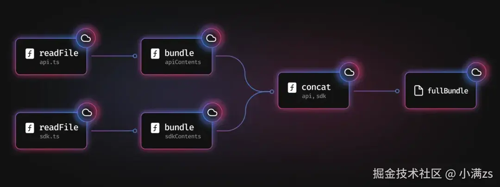
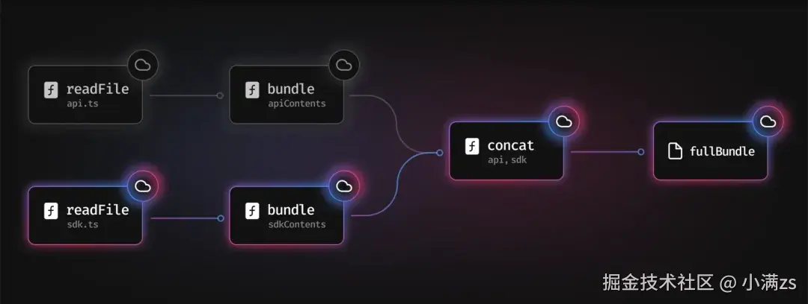

# 第二章（项目搭建）

## 1. 创建项目

npx create-next-app@latest

接下来会有几个问题需要你选择，根据你的需求选择即可

- What is your project named? » my-app 项目名称（必填）
- Would you like to use the recommended Next.js defaults? 是否使用推荐配置 这里我选自定义配置 No, customize settings
- Would you like to use TypeScript? » No / Yes 是否使用 TypeScript 这里我选是 Yes
- Which linter would you like to use? » ESLint / Biome / None 是否使用 ESLint 这里我选是 None
- Would you like to use React Compiler? » No / Yes 是否使用 React Compiler 这里我选是 Yes
- Would you like to use Tailwind CSS? » No / Yes 是否使用 Tailwind CSS 这里我选是 Yes
- Would you like to use src/app directory? » No / Yes 是否使用 src/app 目录 这里我选是 Yes
- Would you like to use App Router? (recommended) » No / Yes 是否使用 App Router 这里我选是 Yes
- Would you like to use Turbopack? (recommended) » No / Yes 是否使用 Turbopack 这里我选是 Yes
- Would you like to customize the import alias (@/_ by default)? » No / Yes 是否自定义导入别名 @/_ 这里我选是 Yes
- What import alias would you like configured? » @/_ 是否自定义导入别名 @/_ 这里我选是 默认 @/\*

## 2. 目录结构介绍

public/ -> 静态资源目录
src/ -> 源代码目录
└─app/ -> App Router 目录
└─layout.tsx -> 跟布局(必须存在 且必须包含 html body 标签)
└─page.tsx -> 首页
└─globals.css -> 全局样式
next-env.d.ts -> TypeScript 类型定义文件
next.config.ts -> Next.js 配置文件
tsconfig.json -> TypeScript 配置文件
postcss.config.mjs -> PostCSS 配置文件(主要用于处理 tailwindcss)
package.json -> 包管理文件
README.md -> 项目说明文件

## 3. FAQ

### 3.1 什么是 Turbopack？

Turbopack 是 Next.js 13.3 版本引入的一个新特性，是一个增量打包器,用于替换 webpack，它使用 Rust 语言编写，并且 Turbopack 转换 js/ts 使用的是 SWC，比 vite 快 10 倍，比 webpack 快 700 倍，速度更快，性能更优。

核心原理：Turbopack 是函数级别的缓存，可以将某些函数，进行标记，当这些函数被调用时，会记住他们被调用的内容，保存到缓存中。



首先我们看到有两个文件 api.ts/ sdk.ts 都调用了 readFile 函数，然后把这两个文件打包成 bundle,然后拼接起来,最后打成一个 fullBundle



例如 sdk.js 发生了变化，而 api.js 没有改变，所以他就只会打包 sdk.js,而不会打包 api.js,只需要从缓存中读取 api.js 内容即可，这样就可以节省非常多的时间，意味着它永远不需要执行两次相同的工作。

### 3.2 什么是 React Compiler?

React Compiler 是 Next.js 用于自动优化组件渲染来提高性能的工具，在之前的话，我们需要手动优化 useMemo / useCallback /memo 等，现在 Next.js 会自动优化，你只需要写代码即可,减少心智负担。

### 3.3 什么是 App Router?

Next.js 有两套路由系统，一个是旧的 Pages Router 路由系统，一个是新的 App Router 路由系统。
首先 Next.js 首推的是 App Router 路由系统

Pages Router 的路由系统是会把 pages 目录下的所有 jsx/tsx 文件，都转换成路由，例如 pages/index.tsx 会转换成/路由，pages/about.tsx 会转换成/about 路由，这样导致我们不能把组件写到 pages 目录下。

目录结构如下

└── pages/
├── index.tsx -> /
├── login.tsx -> /login
├── api/
│ └── user.tsx -> /api/user
├── posts/
│ └── [id].tsx -> /posts/[id]
└── blog/
├── index.tsx -> /blog
└── setting.tsx -> /blog/setting

App Router 的路由系统是根据约定定义的，目录结构如下

src/
└── app
├── page.tsx -> / 首页
├── layout.tsx -> 布局组件
├── template.tsx -> 模板组件
├── loading.tsx -> 加载组件
├── error.tsx -> 错误组件
└── not-found.tsx -> 404 组件
├── xiaoman
│ └── page.tsx -> /xiaoman 小满页面
└── daman
└── page.tsx -> /daman 大满页面

Pages Router 读取数据需要使用 getServerSideProps / getStaticProps / getStaticPaths 等函数，而 App Router 则不需要，直接在组件中使用 fetch 调用即可。

Pages Router:

```tsx
export async function getServerSideProps() {
  const res = await fetch("xxx");
  const data = await res.json();
  return { props: { data } };
}
export default function Home({ data }) {
  return <div>{data.name}</div>;
}
```

App Router:

```tsx
export default async function Home() {
  const res = await fetch("xxx");
  const data = await res.json();
  return <div>{data.name}</div>;
}
```
