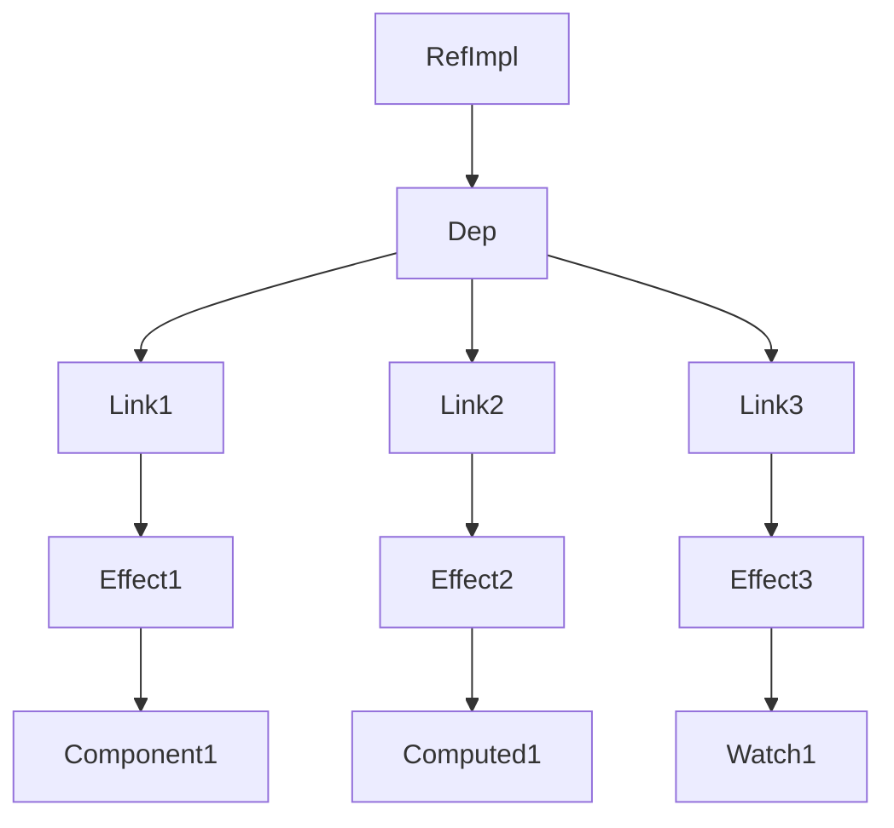

# vue3 中 RefImpl 类属性访问器详解

RefImpl 响应式实现的核心机制

## 1. 响应式系统的三大核心组件

RefImpl 的响应式实现依赖于三个核心组件：
1.1 Dep（依赖收集器）

```ts
class Dep {
  version = 0; // 版本号，用于优化
  activeLink?: Link = undefined; // 当前活跃的链接
  subs?: Link = undefined; // 订阅者链表

  track() {
    /* 收集依赖 */
  }
  trigger() {
    /* 触发更新 */
  }
}
```

1.2 ReactiveEffect（副作用）

```ts
class ReactiveEffect {
  deps?: Link = undefined; // 依赖链表
  flags: EffectFlags; // 状态标志

  run() {
    /* 执行副作用 */
  }
  notify() {
    /* 通知更新 */
  }
}
```

1.3 Link（双向链表节点）

```ts
class Link {
  version: number; // 版本号
  sub: Subscriber; // 订阅者（Effect）
  dep: Dep; // 依赖（Dep）
  nextDep?: Link; // 下一个依赖
  prevDep?: Link; // 上一个依赖
  nextSub?: Link; // 下一个订阅者
  prevSub?: Link; // 上一个订阅者
}
```

## 2. RefImpl 的响应式实现流程

2.1 依赖收集阶段（Track）

```ts
// RefImpl 的 getter
get value() {
  if (__DEV__) {
    this.dep.track({
      target: this,
      type: TrackOpTypes.GET,
      key: 'value',
    })
  } else {
    this.dep.track()  // 关键：收集当前正在执行的副作用
  }
  return this._value
}
```

详细流程：

1. 访问 ref.value 时触发 getter
2. 调用 dep.track() 收集依赖
3. 检查当前是否有活跃的副作用（activeSub）
4. 创建 Link 节点连接 Dep 和 Effect
5. 将 Link 添加到双向链表中

```ts
// Dep.track() 的核心逻辑
track(debugInfo?: DebuggerEventExtraInfo): Link | undefined {
  if (!activeSub || !shouldTrack || activeSub === this.computed) {
    return  // 没有活跃副作用，直接返回
  }

  let link = this.activeLink
  if (link === undefined || link.sub !== activeSub) {
    // 创建新的 Link 节点
    link = this.activeLink = new Link(activeSub, this)

    // 将 link 添加到 activeEffect 的依赖链表中
    if (!activeSub.deps) {
      activeSub.deps = activeSub.depsTail = link
    } else {
      link.prevDep = activeSub.depsTail
      activeSub.depsTail!.nextDep = link
      activeSub.depsTail = link
    }

    addSub(link)  // 将 link 添加到 dep 的订阅者链表中
  }

  return link
}
```

## 2.2 触发更新阶段（Trigger）

```ts
// RefImpl 的 setter
set value(newValue) {
  const oldValue = this._rawValue
  // ... 值处理逻辑 ...

  if (hasChanged(newValue, oldValue)) {
    this._rawValue = newValue
    this._value = useDirectValue ? newValue : toReactive(newValue)

    if (__DEV__) {
      this.dep.trigger({
        target: this,
        type: TriggerOpTypes.SET,
        key: 'value',
        newValue,
        oldValue,
      })
    } else {
      this.dep.trigger()  // 关键：触发所有依赖的副作用
    }
  }
}
```

详细流程：

1. 修改 ref.value 时触发 setter
2. 检查值是否真正改变（hasChanged）
3. 调用 dep.trigger() 触发更新
4. 遍历所有订阅者并执行副作用

```ts
// Dep.trigger() 的核心逻辑
trigger(debugInfo?: DebuggerEventExtraInfo): void {
  this.version++        // 增加版本号
  globalVersion++       // 增加全局版本号
  this.notify(debugInfo)  // 通知所有订阅者
}

notify(debugInfo?: DebuggerEventExtraInfo): void {
  startBatch()  // 开始批量更新
  try {
    // 遍历所有订阅者链表
    for (let link = this.subs; link; link = link.prevSub) {
      if (link.sub.notify()) {
        // 如果是 computed，也触发其依赖
        (link.sub as ComputedRefImpl).dep.notify()
      }
    }
  } finally {
    endBatch()  // 结束批量更新
  }
}
```

## 3. 完整的响应式流程示例

```ts
// 1. 创建 ref
const count = ref(0);

// 2. 创建副作用（组件渲染、计算属性等）
const effect = new ReactiveEffect(() => {
  console.log("count changed:", count.value); // 访问 ref.value
});

// 3. 执行副作用（依赖收集阶段）
effect.run();
// ↓
// 1. 设置 activeSub = effect
// 2. 执行函数，访问 count.value
// 3. 触发 RefImpl.get value()
// 4. 调用 dep.track()
// 5. 创建 Link(count.dep, effect)
// 6. 建立双向链表关系

// 4. 修改值（触发更新阶段）
count.value = 1;
// ↓
// 1. 触发 RefImpl.set value()
// 2. 检查 hasChanged(1, 0) = true
// 3. 调用 dep.trigger()
// 4. 遍历所有订阅者链表
// 5. 调用 effect.notify()
// 6. 重新执行 effect.run()
// 7. 输出: "count changed: 1"
```

4. 双向链表的作用



双向链表的优势：

- 快速添加/删除：O(1) 时间复杂度
- 内存效率：避免使用 Set/Map 的开销
- 版本控制：通过 version 字段优化重复执行

## 5. 关键设计思想

### 5.1 观察者模式

- Dep 是被观察者（Subject）
- Effect 是观察者（Observer）
- Link 是连接两者的桥梁

### 5.2 依赖收集的精确性

- 只有真正访问了 ref.value 的副作用才会被收集
- 通过 activeSub 确保依赖收集的准确性

### 5.3 批量更新优化

- 使用 startBatch() 和 endBatch() 避免重复执行
- 通过 globalVersion 优化计算属性的重新计算

## 6. 总结

RefImpl 实现响应式的核心机制：

- 依赖收集：通过 dep.track() 建立 Dep 和 Effect 的双向链表关系
- 触发更新：通过 dep.trigger() 遍历链表，重新执行所有依赖的副作用
- 双向链表：高效管理多对多的依赖关系
- 版本控制：通过版本号优化重复执行和清理
