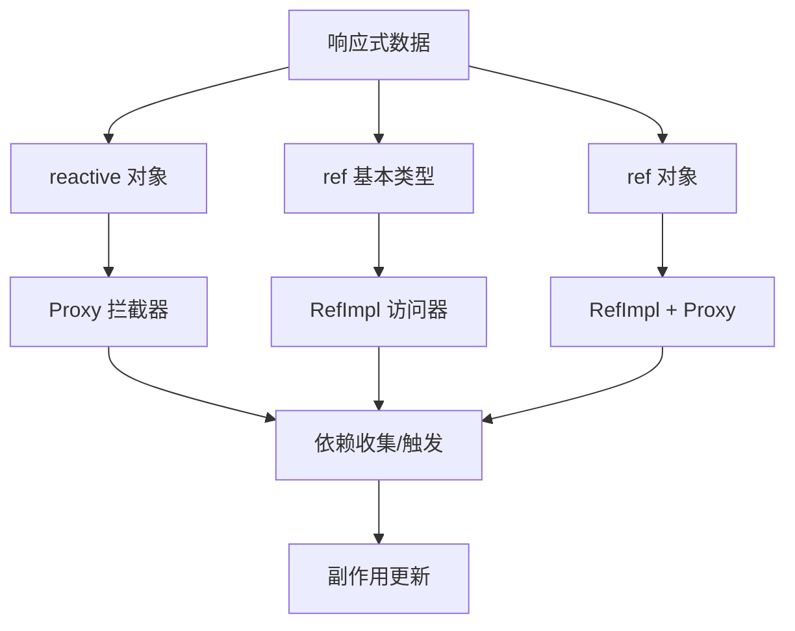

# ref 和 reactive 的区别

## 1. ref 响应数据实现原理详解

### 1. 核心概念

ref 是 Vue 3 响应式系统的核心 API 之一，它将任何值包装成一个响应式引用对象，通过 .value 属性访问和修改内部值。

### 2. 主要组件分析

#### 2.1 Ref 接口定义

```typescript
export interface Ref<T = any, S = T> {
  get value(): T;
  set value(_: S);
  [RefSymbol]: true;
}
```

#### 2.2 RefImpl 核心实现类

```typescript
class RefImpl<T = any> {
  _value: T; // 当前值
  private _rawValue: T; // 原始值
  dep: Dep = new Dep(); // 依赖收集器

  public readonly [ReactiveFlags.IS_REF] = true;
  public readonly [ReactiveFlags.IS_SHALLOW]: boolean = false;
}
```

##### 2.2.1 RefImpl 类结构概览

```ts
class RefImpl<T = any> {
  _value: T; // 当前响应式值
  private _rawValue: T; // 原始值（未经过响应式处理）
  dep: Dep = new Dep(); // 依赖收集器

  public readonly [ReactiveFlags.IS_REF] = true; // 标识这是一个 ref
  public readonly [ReactiveFlags.IS_SHALLOW]: boolean = false; // 是否为浅层响应式
}
```

### 3. 响应式原理详解

#### 3.1 创建 ref 对象

```typescript
export function ref<T>(value: T): Ref<T> {
  return createRef(value, false);
}
function createRef(rawValue: unknown, shallow: boolean) {
  if (isRef(rawValue)) {
    return rawValue; // 如果已经是 ref，直接返回
  }
  return new RefImpl(rawValue, shallow); // 创建新的 RefImpl 实例
}
```

#### 3.2 依赖收集（Track）

当访问 ref.value 时，会触发 getter：

```typescript
 get value() {
   if (__DEV__) {
     this.dep.track({
       target: this,
       type: TrackOpTypes.GET,
       key: 'value',
     })
   } else {
     this.dep.track()  // 收集当前正在执行的副作用
   }
   return this._value
 }
```

依赖收集过程：
当组件渲染或计算属性执行时，会创建一个"副作用"（effect）
访问 ref.value 时，调用 dep.track() 将当前副作用添加到依赖列表中
这样 ref 就知道哪些副作用依赖于它的值

#### 3.3 触发更新（Trigger）

当修改 ref.value 时，会触发 setter：

```typescript
set value(newValue) {
   const oldValue = this._rawValue
   const useDirectValue =
     this[ReactiveFlags.IS_SHALLOW] ||
     isShallow(newValue) ||
     isReadonly(newValue)

   newValue = useDirectValue ? newValue : toRaw(newValue)

   if (hasChanged(newValue, oldValue)) {  // 只有值真正改变时才触发
     this._rawValue = newValue
     this._value = useDirectValue ? newValue : toReactive(newValue)

     if (__DEV__) {
       this.dep.trigger({
         target: this,
         type: TriggerOpTypes.SET,
         key: 'value',
         newValue,
         oldValue,
       })
     } else {
       this.dep.trigger()  // 触发所有依赖的副作用重新执行
     }
   }
 }
```

触发更新过程：

1.  检查新值是否与旧值不同（hasChanged）
2.  更新内部存储的值
3.  调用 dep.trigger() 通知所有依赖的副作用重新执行
4.  副作用重新执行时会重新收集依赖

### 4. 特殊类型 ref

#### 4.1 shallowRef（浅层响应式）

```typescript
export function shallowRef<T>(value: T): ShallowRef<T> {
  return createRef(value, true);
}
```

- 只对 .value 的替换操作进行响应式处理
- 不会对内部对象的属性变化进行深度监听
- 适用于大型不可变数据结构
  #### 4.2 customRef（自定义 ref）

```typescript
export function customRef<T>(factory: CustomRefFactory<T>): Ref<T> {
  return new CustomRefImpl(factory) as any;
}
```

允许开发者自定义依赖收集和触发逻辑，适用于：

- 防抖/节流场景
- 异步数据获取
- 复杂的状态管理

### 5. 工具函数

5.1 toRef 和 toRefs

```ts
// 将响应式对象的属性转换为 ref
export function toRef<T extends object, K extends keyof T>(
  object: T,
  key: K
): ToRef<T[K]>;

// 将响应式对象的所有属性转换为 ref
export function toRefs<T extends object>(object: T): ToRefs<T>;
```

5.2 unref（解包）

```ts
export function unref<T>(ref: MaybeRef<T>): T {
  return isRef(ref) ? ref.value : ref;
}
```

### 6. 响应式流程图

创建 ref → RefImpl 实例
↓
访问 .value → 依赖收集 (track)
↓
修改 .value → 值比较 → 触发更新 (trigger)
↓
重新执行副作用 → 重新收集依赖

### 7. 关键优势

1. 精确的依赖追踪：只有真正访问了 ref.value 的副作用才会被收集
2. 高效的更新机制：只有值真正改变时才触发更新
3. 类型安全：完整的 TypeScript 支持
4. 灵活性：支持浅层响应式、自定义 ref 等多种模式

### 8. 实际应用示例

```ts
// 基本使用
const count = ref(0);
const doubled = computed(() => count.value * 2);
// 对象 ref
const state = ref({ name: "Vue", version: 3 });
// 浅层 ref
const largeData = shallowRef({
  /* 大量数据 */
});
// 自定义 ref（防抖）
const debouncedRef = customRef((track, trigger) => {
  let timeout;
  return {
    get() {
      track();
      return value;
    },
    set(newValue) {
      clearTimeout(timeout);
      timeout = setTimeout(() => {
        value = newValue;
        trigger();
      }, 500);
    },
  };
});
```



## 2. reactive 响应数据实现原理

### 1. 核心概念

在 Vue3 中，reactive 是用于创建响应式数据的核心 API 之一，它基于 JavaScript 的 Proxy 和 Reflect 来实现数据的响应式，并且通过依赖收集和更新触发机制，确保当数据发生变化时，相关的视图或副作用函数能够自动更新。下面将详细讲解其实现原理：

### 2. 使用 Proxy 进行拦截

Proxy 是 ES6 中引入的一个构造函数，它可以对目标对象的各种操作进行拦截，比如属性的读取、设置、删除等。在 Vue3 中，reactive 就是通过 Proxy 来实现对数据的劫持，从而追踪数据的变化。

```ts
function reactive(target) {
  return new Proxy(target, {
    // 拦截属性读取操作
    get(target, key, receiver) {
      // 依赖收集，稍后详细解释
      track(target, key);
      const result = Reflect.get(target, key, receiver);
      // 如果属性值是对象，递归转换为响应式
      if (isObject(result)) {
        return reactive(result);
      }
      return result;
    },
    // 拦截属性设置操作
    set(target, key, value, receiver) {
      const oldValue = Reflect.get(target, key, receiver);
      const result = Reflect.set(target, key, value, receiver);
      if (result && oldValue !== value) {
        // 触发更新，稍后详细解释
        trigger(target, key);
      }
      return result;
    },
    // 拦截属性删除操作
    deleteProperty(target, key) {
      const hadKey = hasOwn(target, key);
      const result = Reflect.deleteProperty(target, key);
      if (result && hadKey) {
        trigger(target, key);
      }
      return result;
    },
  });
}
```

### 3. 依赖收集

依赖收集的目的是记录哪些副作用函数（比如组件的渲染函数、watch 监听函数等）使用了哪些数据属性。当这些属性发生变化时，就可以通知对应的副作用函数重新执行。
在 Vue3 中，使用了一个全局的 WeakMap 来存储依赖关系，其结构如下：

```ts
const targetMap = new WeakMap();

function track(target, key) {
  if (!activeEffect) return;
  let depsMap = targetMap.get(target);
  if (!depsMap) {
    targetMap.set(target, (depsMap = new Map()));
  }
  let dep = depsMap.get(key);
  if (!dep) {
    depsMap.set(key, (dep = new Set()));
  }
  if (!dep.has(activeEffect)) {
    dep.add(activeEffect);
    // 反向记录，方便清理
    activeEffect.deps.push(dep);
  }
}
```

其中，activeEffect 表示当前正在执行的副作用函数，它是在 effect 函数内部被赋值的：

```ts
let activeEffect;

function effect(fn) {
  const effectFn = () => {
    try {
      activeEffect = effectFn;
      fn();
    } finally {
      activeEffect = null;
    }
  };
  effectFn.deps = [];
  effectFn();
  return effectFn;
}
```

### 4.深层响应式

在 get 拦截器中，当读取到的属性值是对象时，会递归调用 reactive 函数，将其转换为响应式对象，从而实现深层响应式：

```ts
function isObject(value) {
  return typeof value === "object" && value !== null;
}

function reactive(target) {
  return new Proxy(target, {
    get(target, key, receiver) {
      track(target, key);
      const result = Reflect.get(target, key, receiver);
      if (isObject(result)) {
        return reactive(result);
      }
      return result;
    },
    // 其他拦截器...
  });
}
```

### 5. 更新触发

当通过 set 拦截器检测到属性值发生变化时，就会触发更新操作，通知所有依赖该属性的副作用函数重新执行：

```ts
function trigger(target, key) {
  const depsMap = targetMap.get(target);
  if (!depsMap) return;
  const dep = depsMap.get(key);
  if (dep) {
    // 遍历依赖集合，执行每个副作用函数
    dep.forEach((effectFn) => effectFn());
  }
}
```

### 6. 缓存代理对象

为了避免对同一个对象重复创建代理，Vue3 使用了一个 WeakMap 来缓存已经创建的代理对象：

```ts
const reactiveMap = new WeakMap();

function reactive(target) {
  if (reactiveMap.has(target)) {
    return reactiveMap.get(target);
  }
  const proxy = new Proxy(target, {
    // 拦截器...
  });
  reactiveMap.set(target, proxy);
  return proxy;
}
```

### 7. 局限性和补充

reactive 只能对对象和数组进行响应式处理，对于基本数据类型，需要使用 ref 来实现响应式。ref 内部会将基本数据类型包装成一个对象，然后通过类似的机制实现响应式。此外，reactive 创建的响应式对象在一些复杂场景下（比如对象的解构、展开等操作）可能会丢失响应式，这时可以使用 toRefs 或 toRef 来保持响应式。
